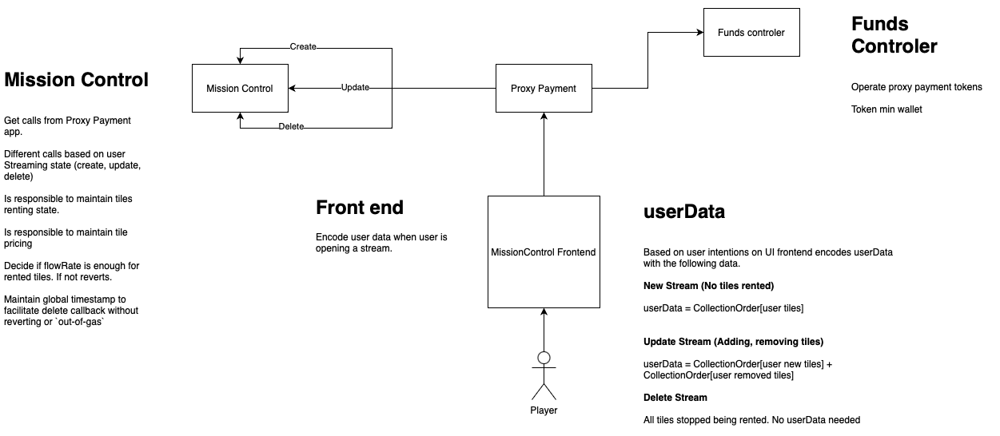

# Superfluid-PlanetIX

## MissionControlStream

This smart contract is a SuperApp for the Superfluid protocol that allows users to stream a game and rent tiles on __PlanetIX__. The contract utilizes the IMissionControl interface to allow users to create, update, and delete rented tiles.


### Functions

#### Constructor

The contract is initialized with the following parameters:

````solidity
constructor(ISuperfluid _host,ISuperToken _acceptedToken,address _missionControl,string memory _registrationKey)
````

```
_host: the address of the ISuperfluid contract hosting the app
_acceptedToken: the address of the ISuperToken contract that will be accepted for payment
_missionControl: the address of the IMissionControl contract that will handle the rental of tiles
_registrationKey: a string used to register the app with the host contract
```

#### afterAgreementCreated
This function is called by the host contract when a new stream is created and is used to process the rental of tiles.
Calls MissionControl's `createRentTiles` function with the following parameters:
```solidity
function createRentTiles(address supertoken, address renter, CollectOrder[] memory tiles, int96 flowRate) external;
```

```
supertoken: the address of the ISuperToken contract that will be accepted for payment
renter: the address of the user creating the stream
tiles: an array of CollectOrder structs that contain the tile coordinates and the amount of time to rent the tile
flowRate: the flow rate of the stream
```

#### afterAgreementUpdated
This function is called by the host contract when a existing stream is updated and is used to process the updating of rented tiles.
Calls MissionControl's `updateRentTiles` function with the following parameters:
```solidity
function updateRentTiles(address supertoken, address renter, CollectOrder[] memory addTiles, CollectOrder[] memory removeTiles, int96 flowRate) external;
```

```
supertoken: the address of the ISuperToken contract that is being used for payment
renter: the address of the user that is renting the tiles
addTiles: an array of CollectOrder structs that contain the tile ids and amounts to be added to the rental
removeTiles: an array of CollectOrder structs that contain the tile ids and amounts to be removed from the rental
flowRate: the flow rate of the stream
```

#### beforeAgreementTerminated
This function is called by the host contract when a stream is terminated and is used to process the removal of rented tiles.
Calls MissionControl's `deleteRentTiles` function with the following parameters:
```solidity
function deleteRentTiles(address supertoken, address renter) external;
```

```
supertoken: the address of the ISuperToken contract that is being used for payment
renter: the address of the user that is renting the tiles
```


#### Approve - Funds Controller
Allows the contract owner to approve another address to move the ISuperToken contract on behalf of the MissionControlStream contract.


## Global Architecture
[](img/baseDiagram.png)