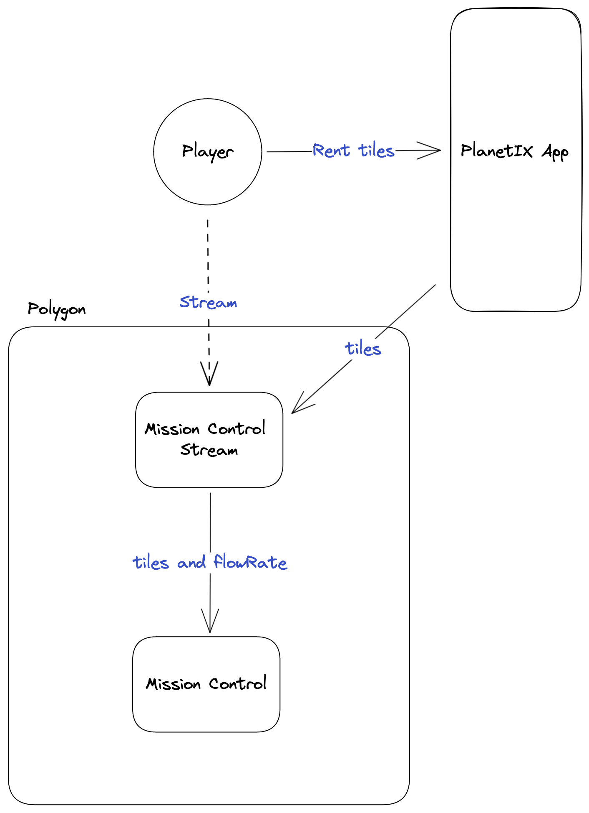
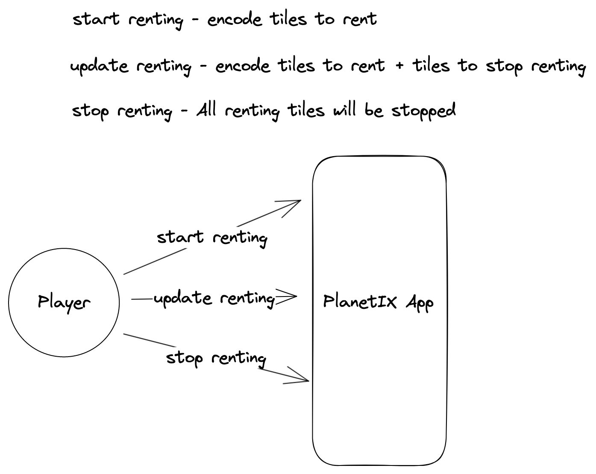
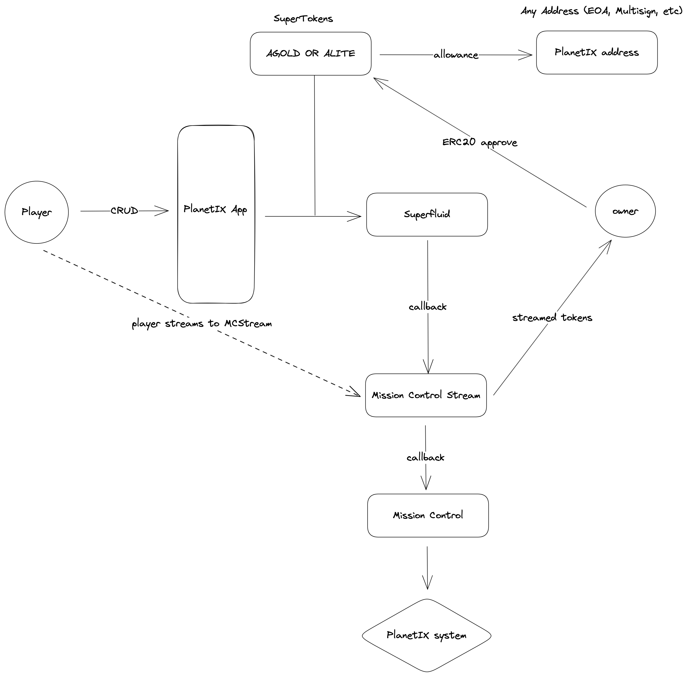

# Superfluid-PlanetIX

## MissionControlStream

This smart contract is a SuperApp for the Superfluid protocol that allows users to stream a game and rent tiles on __PlanetIX__. The contract utilizes the IMissionControl interface to allow users to create, update, and delete rented tiles.

Players can use SuperTokens `Astro Gold` and `Astro Gold Lite` to rent tiles.

### Getting Started

You'll need to have the following tools installed:

**Foundry**: Development environment for smart contracts
**Hardhat**: Deployment of smart contracts and SuperTokens
**Yarn** is used as the package manager.

Run tests
```bash
forge test --vvv
```

### Read the Docs
Generate and view the documentation for the smart contracts
```bash
forge doc --serve 
```

### Deploying SuperApp & Verifying


```bash
npx hardhat deploySuperApp --network <network> --mission <missionControlAddress> --token1 <SuperToken1Address> --token2 <SuperToken2Address>

npx hardhat verify --network <network> <SuperAppAddress>
```

### Upgrading SuperApp
    
```bash
npx hardhat upgradeSuperApp --network <network> --superApp <superAppAddr>
```

### Deploying SuperToken & Verifying

```bash
npx hardhat deploySuperToken --network <network>

npx hardhat verify --network <network> <SuperTokenAddress>
```

### Table of Contracts
| Contract                   | Description                                                 |
|----------------------------|-------------------------------------------------------------|
| `MissionControlStream`     | SuperApp for streaming a game and renting tiles on PlanetIX |
| `IMissionControlExtension` | Interface for the PlanetIX MissionControl contract          |
| `GoldLiteProxy`            | SuperToken that can be minted by the trusted minter         |


### Upgradable Contracts

The `MissionControlStream` contract is upgradable, using Transparent Proxy, the contract can be upgraded without affecting the state of the contract.


### Approve - Funds Controller
Allows the contract owner to approve another address to move the ISuperToken contract on behalf of the MissionControlStream contract.

### Deployed Contracts
| Contract               | Network | Address                                                                                                                  |
|------------------------|---------|--------------------------------------------------------------------------------------------------------------------------|
| `MissionControlStream` | Polygon | [0xb9d70840cca6e6f71d3c884060ee123e13b4c27d](https://polygonscan.com/address/address/0xb9d70840cca6e6f71d3c884060ee123e13b4c27d)  |
| `SuperToken AGOLD`     | Polygon | [0xfac83774854237b6e31c4b051b91015e403956d3](https://polygonscan.com/address/0xfac83774854237b6e31c4b051b91015e403956d3)    |
| `SuperToken ALITE`     | Polygon | [0x9308A7116106269eB11834dF494eFd00d244cF8e](https://polygonscan.com/address/0x9308A7116106269eB11834dF494eFd00d244cF8e) |

## Renting Tiles
[](img/basic_interaction.png)

## User Operations
[](img/user_crud_operations.png)

## Global Overview
[](img/overview.png)


